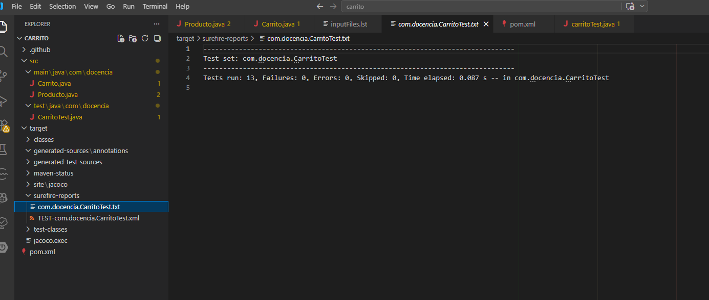

# Análisis de errores detectados

## Tests que han fallado

El test que ha allado es:

- `testTotalConDescuento`

Este test esperaba un resultado de **90**, pero el resultado ha sido **95**.

### Motivo

Según el test, el envío no se aplica después del descuento o es gratuito.

Pero en la implementación el envío se calcula después de aplicar el descuento, por lo que el total final incluye 5€ de envío.

---

## Identificación de errores en el código

No hay un error en el código, sino una mala interpretación con el enunciado.

### Método implicado:
`calcularTotal(List<Producto> carrito, double descuento)`

### Comportamiento actual:

El envío se calcula después de aplicar el descuento:

` double envio = calcularEnvio(conDescuento); `

## Resultado final

Tras diseñar los tests y analizar el código:

- ¿Cuántos tests has implementado?  
  He implementado 13 tests en total.

- ¿Qué porcentaje de cobertura has obtenido?
  A la hora de abrir el index dentro de la carpeta target, no me aparece dicha imagen de la cobertura de test en jacoco, adjunto esta foto de los test en un .txt.
  
  

- ¿Todos los tests pasan correctamente?  
  Sí, todos los tests pasan correctamente después de corregir el error que hacía que fallara.
